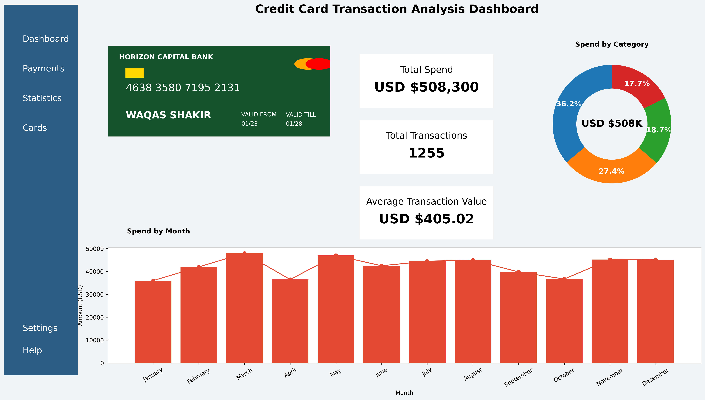

# Credit Card Transaction Analysis Dashboard

A professional analytics dashboard built using **Python and Matplotlib** to visualize credit card spending patterns and financial insights.
This project demonstrates how Python can be used to build dashboards similar to traditional Business Intelligence tools like Power BI or Tableau.

## Dashboard Preview

## Project Overview
The dashboard provides a clear visual representation of credit card transaction data including:

• Monthly spending trends  
• Category-wise spending distribution  
• Key financial performance indicators  
• Transaction behavior insights  

The goal of this project was to replicate the feel of a **modern analytics dashboard using only Python code**.

## Key Features

### KPI Cards
Instant visibility into key financial metrics:

- Total Spend
- Total Transactions
- Average Transaction Value

### Monthly Spending Trend 
A **Bar + Line combination chart** to identify spending patterns throughout the year.

### Category-wise Spending Distribution
A **Donut Chart** highlighting where the majority of money is spent.

### Custom Dashboard Layout
A structured UI layout created using **Matplotlib patches and custom positioning**.

### Credit Card Visualization
A realistic credit card component designed to enhance the dashboard's visual experience.

## Technologies Used

- Python
- Matplotlib
- Pandas
- NumPy

## Project Structure
credit-card-transaction-dashboard-python
│
├── notebooks
│ └── credit-card-transaction-analysis_dashboard.ipynb
│
├── images
│ └── dashboard_preview.png
│
├── src
│ └── dashboard.py
│
├── requirements.txt
└── README.md

